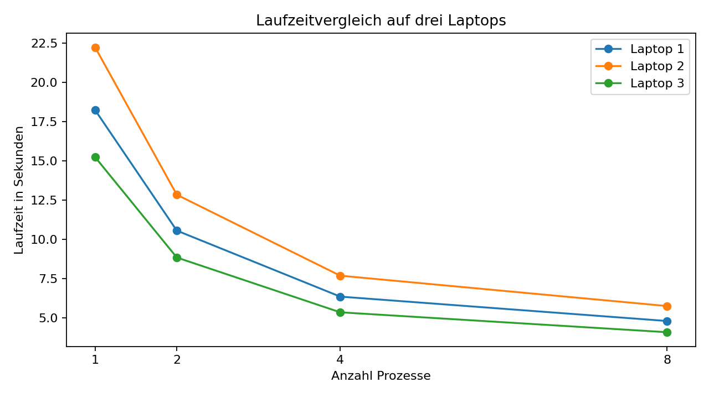
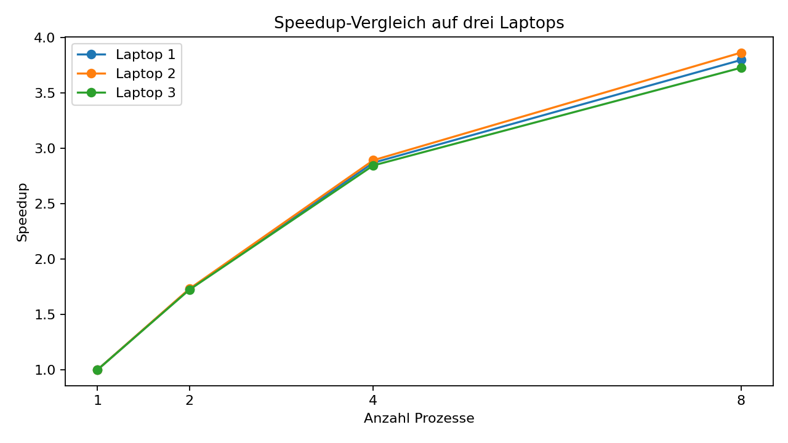
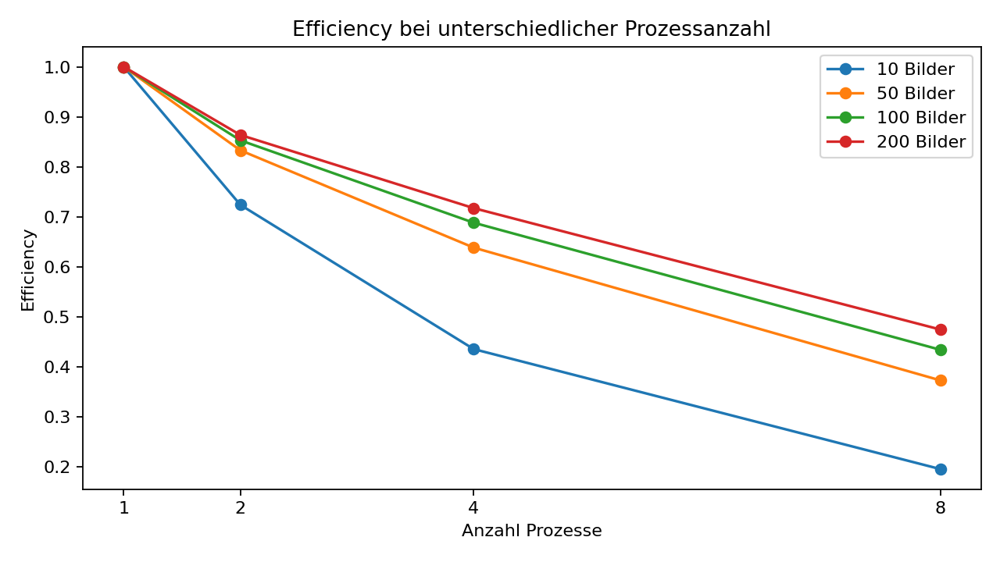
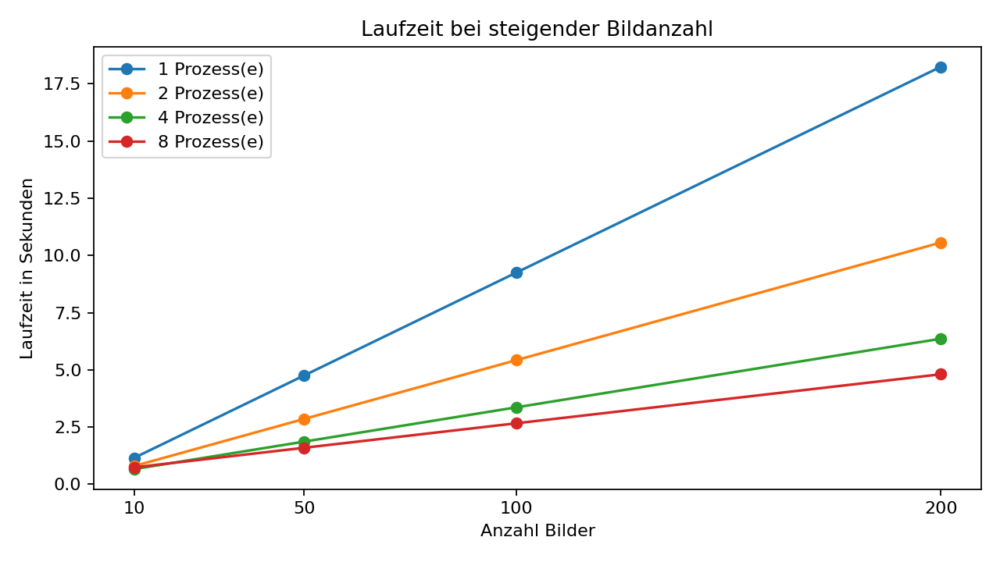

# Parallel Systems: Benchmarking einer parallelen medizinischen Bildverarbeitung

Dieses Repository enthält den Code und die Ergebnisse für das Projekt **„Entwicklung und Benchmarking einer parallelen Anwendung“** im Kurs Parallel Systems an der HTW Berlin, Sommersemester 2026.

Ziel des Projekts ist der Vergleich einer sequenziellen und einer parallelen Bildverarbeitungspipeline mit Python Multiprocessing. Als Anwendungsfall werden Röntgen, also medizinische Bilder verarbeitet.

Der Fokus liegt nicht auf medizinischer Diagnose, sondern auf der technischen Untersuchung der Parallelisierung.

## Aufgaben des Projekts

Ein einzelnes Bild wird dieser Pipeline verarbeitet:

1. Bild laden
2. Bildgröße zu 512×512 
3. Bild in Graustufen umwandeln
4. Helligkeit und Kontrast anpassen
5. Rauschen reduzieren, Blur-Filter
6. Histogramm der Grauwerte berechnen
7. Ergebnis speichern

## Testumgebung

| Laptop   | Prozessor                                |                  Kerne / Threads |    RAM | Betriebssystem |
| -------- | ---------------------------------------- | -------------------------------: | -----: | -------------- |
|  1 | Intel(R) Core(TM) Ultra 7 258V, 2200 MHz | 8 Kerne / 8 logische Prozessoren | 32 GB | Windows        |
|  2 | AMD Ryzen 7 PRO 7840U   | 8 Kerne / 16 logische Prozessoren | 32 GB | xxx            |
|  3 | xxx                                      |                              xxx | xxx GB | Linux Mint 22.2       |

## Varianten

Die Bildverarbeitung bleibt beiden Varianten identisch. Der Unterschied liegt  in der Ausführung:

| Variante | Name                       | Beschreibung                                                          |
| -------: | -------------------------- | --------------------------------------------------------------------- |
|        1 | Sequenziell     | Ein Prozess verarbeitet alle Bilder nacheinander         |
|        2 | Multiprocessing | Mehrere Prozesse verarbeiten mehrere Bilder parallel |

# Benchmark

## Ergebnisse - Platzhalter

### Bildverarbeitung

<table width="100%">
  <tr>
    <td width="30%"></td>
    <td align="center" width="5%">></td>
    <td width="30%"></td>
    <td align="center" width="5%">></td>
    <td width="30%"></td>
  </tr>
  <tr>
    <td align="center">Originalbild</td>
    <td></td>
    <td align="center">Graustufenbild</td>
    <td></td>
    <td align="center">Kontrast / Helligkeit / Filter</td>
  </tr>
</table>

---

### Histogramm

<table width="100%">
  <tr>
    <td width="100%"></td>
  </tr>
  <tr>
    <td align="center">Histogramm der Grauwerte</td>
  </tr>
</table>

---

### Diagramme

<table width="100%">
  <tr>
    <td width="100%"></td>
  </tr>
  <tr>
    <td align="center">Laufzeitvergleich bei 200 Bildern</td>
  </tr>

  <tr>
    <td width="100%"></td>
  </tr>
  <tr>
    <td align="center">Speedup-Vergleich bei 200 Bildern</td>
  </tr>

  <tr>
    <td width="100%"></td>
  </tr>
  <tr>
    <td align="center">Efficiency bei unterschiedlicher Prozessanzahl bei Laptop 1</td>
  </tr>

  <tr>
    <td width="100%"></td>
  </tr>
  <tr>
    <td align="center">Laufzeit bei steigender Bildanzahl bei Laptop 1</td>
  </tr>
</table>

---

## Messung

Pro Kombination aus Bildanzahl und Prozessanzahl 10 Runs, Laufzeit als Median

| Laptop | Bilder | Prozesse | Laufzeit in s | Speedup | Efficiency |
| -----: | -----: | -------: | ------------: | ------: | ---------: |
|      1 |     10 |        1 |           xxx |    1.00 |       1.00 |
|      1 |     10 |        2 |           xxx |     xxx |        xxx |
|      1 |     10 |        4 |           xxx |     xxx |        xxx |
|      1 |     10 |        8 |           xxx |     xxx |        xxx |
|      1 |     50 |        1 |           xxx |    1.00 |       1.00 |
|      1 |     50 |        2 |           xxx |     xxx |        xxx |
|      1 |     50 |        4 |           xxx |     xxx |        xxx |
|      1 |     50 |        8 |           xxx |     xxx |        xxx |
|      1 |    100 |        1 |           xxx |    1.00 |       1.00 |
|      1 |    100 |        2 |           xxx |     xxx |        xxx |
|      1 |    100 |        4 |           xxx |     xxx |        xxx |
|      1 |    100 |        8 |           xxx |     xxx |        xxx |
|      1 |    200 |        1 |           xxx |    1.00 |       1.00 |
|      1 |    200 |        2 |           xxx |     xxx |        xxx |
|      1 |    200 |        4 |           xxx |     xxx |        xxx |
|      1 |    200 |        8 |           xxx |     xxx |        xxx |
|      2 |     10 |        1 |           xxx |    1.00 |       1.00 |
|      2 |     10 |        2 |           xxx |     xxx |        xxx |
|      2 |     10 |        4 |           xxx |     xxx |        xxx |
|      2 |     10 |        8 |           xxx |     xxx |        xxx |
|      2 |     50 |        1 |           xxx |    1.00 |       1.00 |
|      2 |     50 |        2 |           xxx |     xxx |        xxx |
|      2 |     50 |        4 |           xxx |     xxx |        xxx |
|      2 |     50 |        8 |           xxx |     xxx |        xxx |
|      2 |    100 |        1 |           xxx |    1.00 |       1.00 |
|      2 |    100 |        2 |           xxx |     xxx |        xxx |
|      2 |    100 |        4 |           xxx |     xxx |        xxx |
|      2 |    100 |        8 |           xxx |     xxx |        xxx |
|      2 |    200 |        1 |           xxx |    1.00 |       1.00 |
|      2 |    200 |        2 |           xxx |     xxx |        xxx |
|      2 |    200 |        4 |           xxx |     xxx |        xxx |
|      2 |    200 |        8 |           xxx |     xxx |        xxx |
|      3 |     10 |        1 |           xxx |    1.00 |       1.00 |
|      3 |     10 |        2 |           xxx |     xxx |        xxx |
|      3 |     10 |        4 |           xxx |     xxx |        xxx |
|      3 |     10 |        8 |           xxx |     xxx |        xxx |
|      3 |     50 |        1 |           xxx |    1.00 |       1.00 |
|      3 |     50 |        2 |           xxx |     xxx |        xxx |
|      3 |     50 |        4 |           xxx |     xxx |        xxx |
|      3 |     50 |        8 |           xxx |     xxx |        xxx |
|      3 |    100 |        1 |           xxx |    1.00 |       1.00 |
|      3 |    100 |        2 |           xxx |     xxx |        xxx |
|      3 |    100 |        4 |           xxx |     xxx |        xxx |
|      3 |    100 |        8 |           xxx |     xxx |        xxx |
|      3 |    200 |        1 |           xxx |    1.00 |       1.00 |
|      3 |    200 |        2 |           xxx |     xxx |        xxx |
|      3 |    200 |        4 |           xxx |     xxx |        xxx |
|      3 |    200 |        8 |           xxx |     xxx |        xxx |

---

## Interpretation

## Getting Started

### Dependencies

* Python 3.10+
* NumPy
* pandas
* matplotlib
* Pillow
* OpenCV

## Installation

## Authors

## License

This project is licensed under the MIT License.

## Acknowledgments
