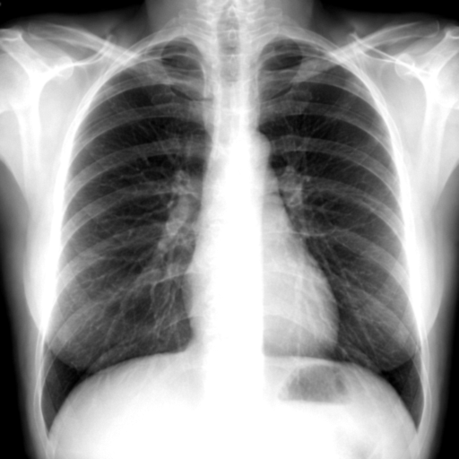
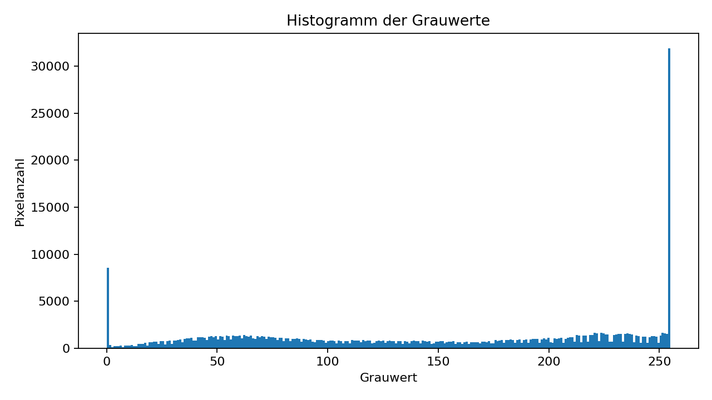

# Parallel Systems: Benchmarking einer parallelen medizinischen Bildverarbeitung

Dieses Repository enthält den Code und die Ergebnisse für das Projekt **„Entwicklung und Benchmarking einer parallelen Anwendung“** im Kurs Parallel Systems an der HTW Berlin, Sommersemester 2026.

Ziel des Projekts ist der Vergleich von Multiprocessing Ansätzen für die medizinische Bildverarbeitung. Als Anwendungsfall werden Röntgenbilder verarbeitet.

Der Fokus liegt nicht auf medizinischer Diagnose, sondern auf der technischen Untersuchung der Parallelisierung.

## Aufgaben des Projekts

Ein einzelnes Bild wird dieser Pipeline verarbeitet:

1. Bild laden
2. Bildgröße ändern
3. Bild in Graustufen umwandeln
4. Helligkeit und Kontrast anpassen
5. Rauschen reduzieren, Gaussian Filter
6. Histogramm der Grauwerte berechnen
7. Ergebnis speichern

Die Bildverarbeitung erfolgt mit OpenCV. Die Parallelisierung erfolgt mit Python Multiprocessing,
aber ohne internes Multithreading, cv2.setNumThreads(1)

## Testumgebung

| Laptop   | Prozessor                                |                  Kerne / Threads |    RAM | Betriebssystem |
| -------- | ---------------------------------------- | -------------------------------: | -----: | -------------- |
|  1 | Intel(R) Core(TM) Ultra 7 258V, 2200 MHz | 8 Kerne / 8 logische Prozessoren | 32 GB | Windows        |
|  2 | AMD Ryzen 7 PRO 7840U   | 8 Kerne / 16 logische Prozessoren | 32 GB | Linux Mint 22.2             |
|  3 | xxx                                      |                              xxx | xxx GB | XXX      |

## Varianten

Die Bildverarbeitung bleibt in allen Varianten identisch. Der Unterschied in der Verteilung der Bilder auf Prozesse.

| Variante | Name | Technologie | Beschreibung |
| -------: | -------------------------- | -------------------------- | --------------------------------------------------------------------- |
| 1 | Sequenziell | Python + OpenCV | Ein Prozess verarbeitet alle Bilder nacheinander |
| 2 | Multiprocessing static | Python multiprocessing.Process + OpenCV | Die Bilder werden vorher fest auf mehrere Prozesse aufgeteilt |
| 3 | Multiprocessing dynamic | Python multiprocessing.Pool Queue + OpenCV | Prozesse holen sich dynamisch neue Bilder, wenn sie fertig verarbeitet sind |

# Benchmark

## Testdaten

Es werden zwei Testarten betrachtet:

1. Steigende Bildanzahl bei gleicher Auflösung

2. Steigende Bildanzahl bei unterschiedlicher Auflösung

## Ergebnisse - Platzhalter

### Bildverarbeitung

<table width="100%">
  <tr>
    <td width="30%"></td>
    <td align="center" width="5%">></td>
    <td width="30%"></td>
    <td align="center" width="5%">></td>
    <td width="30%"></td>
  </tr>
  <tr>
    <td align="center">Originalbild</td>
    <td></td>
    <td align="center">Graustufenbild</td>
    <td></td>
    <td align="center">Kontrast / Helligkeit / Filter</td>
  </tr>
</table>

### Histogramm

<table width="100%">
  <tr>
    <td width="100%"></td>
  </tr>
  <tr>
    <td align="center">Histogramm der Grauwerte</td>
  </tr>
</table>

### Diagramme

<table width="100%">
  <tr>
    <td width="100%"></td>
  </tr>
  <tr>
    <td align="center">Laufzeit bei steigender Bildanzahl auf allen drei Laptops.</td>
  </tr>

  <tr>
    <td width="100%"></td>
  </tr>
  <tr>
    <td align="center">Speedup bei 2, 4 und 8 Prozessen auf allen drei Laptops.</td>
  </tr>

  <tr>
    <td width="100%"></td>
  </tr>
  <tr>
    <td align="center">Efficiency bei 2, 4 und 8 Prozessen auf allen drei Laptops.</td>
  </tr>

  <tr>
    <td width="100%"></td>
  </tr>
  <tr>
    <td align="center">Vergleich von Baselinem, Static, Dynamic Multiprocessing auf allen drei Laptops.</td>
  </tr>
</table>

## Messung

Pro Kombination aus Bildanzahl, Variante und Prozessanzahl werden 10 Runs durchgeführt. Als Laufzeit wird der Median verwendet.

| Laptop | Variante | Bilder | Prozesse | Laufzeit in s | Speedup | Efficiency | Throughput |
| -----: | -------- | -----: | -------: | ------------: | ------: | ---------: | ---------: |
| 1 | Sequenziell | 100 | 1 | xxx | 1.00 | 1.00 | xxx |
| 1 | Static | 100 | 2 | xxx | xxx | xxx | xxx |
| 1 | Static | 100 | 4 | xxx | xxx | xxx | xxx |
| 1 | Static | 100 | 8 | xxx | xxx | xxx | xxx |
| 1 | Dynamic | 100 | 2 | xxx | xxx | xxx | xxx |
| 1 | Dynamic | 100 | 4 | xxx | xxx | xxx | xxx |
| 1 | Dynamic | 100 | 8 | xxx | xxx | xxx | xxx |
| 1 | Sequenziell | 500 | 1 | xxx | 1.00 | 1.00 | xxx |
| 1 | Static | 500 | 2 | xxx | xxx | xxx | xxx |
| 1 | Static | 500 | 4 | xxx | xxx | xxx | xxx |
| 1 | Static | 500 | 8 | xxx | xxx | xxx | xxx |
| 1 | Dynamic | 500 | 2 | xxx | xxx | xxx | xxx |
| 1 | Dynamic | 500 | 4 | xxx | xxx | xxx | xxx |
| 1 | Dynamic | 500 | 8 | xxx | xxx | xxx | xxx |
| 1 | Sequenziell | 1000 | 1 | xxx | 1.00 | 1.00 | xxx |
| 1 | Static | 1000 | 2 | xxx | xxx | xxx | xxx |
| 1 | Static | 1000 | 4 | xxx | xxx | xxx | xxx |
| 1 | Static | 1000 | 8 | xxx | xxx | xxx | xxx |
| 1 | Dynamic | 1000 | 2 | xxx | xxx | xxx | xxx |
| 1 | Dynamic | 1000 | 4 | xxx | xxx | xxx | xxx |
| 1 | Dynamic | 1000 | 8 | xxx | xxx | xxx | xxx |
| 1 | Sequenziell | 5000 | 1 | xxx | 1.00 | 1.00 | xxx |
| 1 | Static | 5000 | 2 | xxx | xxx | xxx | xxx |
| 1 | Static | 5000 | 4 | xxx | xxx | xxx | xxx |
| 1 | Static | 5000 | 8 | xxx | xxx | xxx | xxx |
| 1 | Dynamic | 5000 | 2 | xxx | xxx | xxx | xxx |
| 1 | Dynamic | 5000 | 4 | xxx | xxx | xxx | xxx |
| 1 | Dynamic | 5000 | 8 | xxx | xxx | xxx | xxx |
| 2 | Sequenziell | 100 | 1 | xxx | 1.00 | 1.00 | xxx |
| 2 | Static | 100 | 2 | xxx | xxx | xxx | xxx |
| 2 | Static | 100 | 4 | xxx | xxx | xxx | xxx |
| 2 | Static | 100 | 8 | xxx | xxx | xxx | xxx |
| 2 | Dynamic | 100 | 2 | xxx | xxx | xxx | xxx |
| 2 | Dynamic | 100 | 4 | xxx | xxx | xxx | xxx |
| 2 | Dynamic | 100 | 8 | xxx | xxx | xxx | xxx |
| 2 | Sequenziell | 500 | 1 | xxx | 1.00 | 1.00 | xxx |
| 2 | Static | 500 | 2 | xxx | xxx | xxx | xxx |
| 2 | Static | 500 | 4 | xxx | xxx | xxx | xxx |
| 2 | Static | 500 | 8 | xxx | xxx | xxx | xxx |
| 2 | Dynamic | 500 | 2 | xxx | xxx | xxx | xxx |
| 2 | Dynamic | 500 | 4 | xxx | xxx | xxx | xxx |
| 2 | Dynamic | 500 | 8 | xxx | xxx | xxx | xxx |
| 2 | Sequenziell | 1000 | 1 | xxx | 1.00 | 1.00 | xxx |
| 2 | Static | 1000 | 2 | xxx | xxx | xxx | xxx |
| 2 | Static | 1000 | 4 | xxx | xxx | xxx | xxx |
| 2 | Static | 1000 | 8 | xxx | xxx | xxx | xxx |
| 2 | Dynamic | 1000 | 2 | xxx | xxx | xxx | xxx |
| 2 | Dynamic | 1000 | 4 | xxx | xxx | xxx | xxx |
| 2 | Dynamic | 1000 | 8 | xxx | xxx | xxx | xxx |
| 2 | Sequenziell | 5000 | 1 | xxx | 1.00 | 1.00 | xxx |
| 2 | Static | 5000 | 2 | xxx | xxx | xxx | xxx |
| 2 | Static | 5000 | 4 | xxx | xxx | xxx | xxx |
| 2 | Static | 5000 | 8 | xxx | xxx | xxx | xxx |
| 2 | Dynamic | 5000 | 2 | xxx | xxx | xxx | xxx |
| 2 | Dynamic | 5000 | 4 | xxx | xxx | xxx | xxx |
| 2 | Dynamic | 5000 | 8 | xxx | xxx | xxx | xxx |
| 3 | Sequenziell | 100 | 1 | xxx | 1.00 | 1.00 | xxx |
| 3 | Static | 100 | 2 | xxx | xxx | xxx | xxx |
| 3 | Static | 100 | 4 | xxx | xxx | xxx | xxx |
| 3 | Static | 100 | 8 | xxx | xxx | xxx | xxx |
| 3 | Dynamic | 100 | 2 | xxx | xxx | xxx | xxx |
| 3 | Dynamic | 100 | 4 | xxx | xxx | xxx | xxx |
| 3 | Dynamic | 100 | 8 | xxx | xxx | xxx | xxx |
| 3 | Sequenziell | 500 | 1 | xxx | 1.00 | 1.00 | xxx |
| 3 | Static | 500 | 2 | xxx | xxx | xxx | xxx |
| 3 | Static | 500 | 4 | xxx | xxx | xxx | xxx |
| 3 | Static | 500 | 8 | xxx | xxx | xxx | xxx |
| 3 | Dynamic | 500 | 2 | xxx | xxx | xxx | xxx |
| 3 | Dynamic | 500 | 4 | xxx | xxx | xxx | xxx |
| 3 | Dynamic | 500 | 8 | xxx | xxx | xxx | xxx |
| 3 | Sequenziell | 1000 | 1 | xxx | 1.00 | 1.00 | xxx |
| 3 | Static | 1000 | 2 | xxx | xxx | xxx | xxx |
| 3 | Static | 1000 | 4 | xxx | xxx | xxx | xxx |
| 3 | Static | 1000 | 8 | xxx | xxx | xxx | xxx |
| 3 | Dynamic | 1000 | 2 | xxx | xxx | xxx | xxx |
| 3 | Dynamic | 1000 | 4 | xxx | xxx | xxx | xxx |
| 3 | Dynamic | 1000 | 8 | xxx | xxx | xxx | xxx |
| 3 | Sequenziell | 5000 | 1 | xxx | 1.00 | 1.00 | xxx |
| 3 | Static | 5000 | 2 | xxx | xxx | xxx | xxx |
| 3 | Static | 5000 | 4 | xxx | xxx | xxx | xxx |
| 3 | Static | 5000 | 8 | xxx | xxx | xxx | xxx |
| 3 | Dynamic | 5000 | 2 | xxx | xxx | xxx | xxx |
| 3 | Dynamic | 5000 | 4 | xxx | xxx | xxx | xxx |
| 3 | Dynamic | 5000 | 8 | xxx | xxx | xxx | xxx |

## Interpretation

## Getting Started

### Dependencies

* Python 3.10+
* NumPy
* pandas
* matplotlib
* Pillow
* OpenCV

## Installation

## Authors

## License

This project is licensed under the MIT License.

## Acknowledgments
